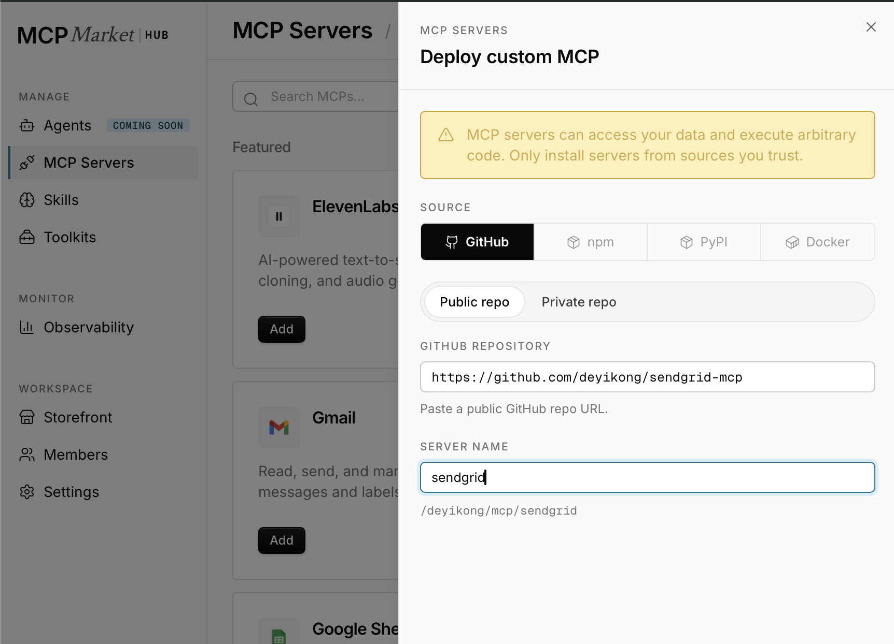
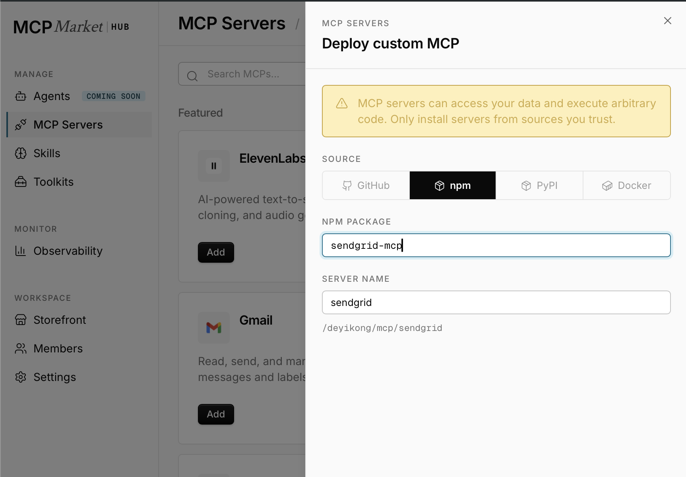
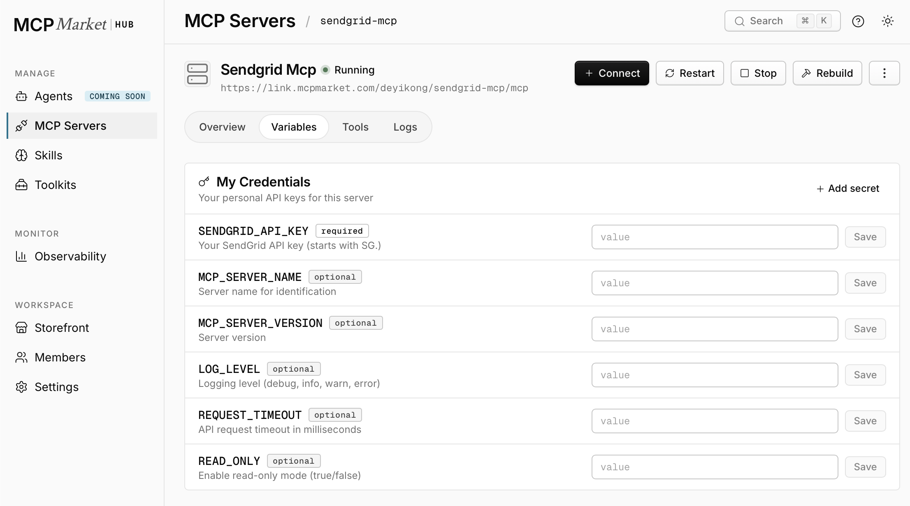
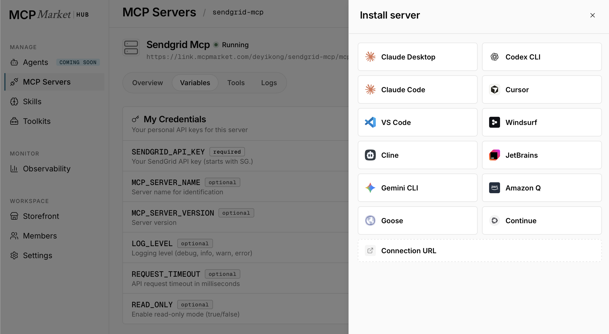

# SendGrid MCP Server

A Model Context Protocol (MCP) server that provides comprehensive access to SendGrid's API v3 for email marketing, transactional email operations, dynamic template management, and detailed analytics. Features 58 tools covering all aspects of email management and performance analysis.

*Built and maintained by a SendGrid engineer, as an independent project — not an official SendGrid product.*

> **v1.1.0 — new:** Streamable HTTP transport with OAuth 2.1 (resource server), in-process TLS, and proxy support. Connect this server from Claude custom connectors, the OpenAI Responses API `mcp` tool, or any remote MCP client. See [Remote / HTTP mode](#remote--http-mode) and [RELEASES.md](./RELEASES.md).

## Features

- **Marketing Automations**: Create and manage email automation workflows
- **Single Send Campaigns**: Manage one-time email campaigns with detailed performance tracking
- **Contact Management**: Complete CRUD operations for contacts with advanced search and bulk operations
- **Email Statistics & Analytics**: Multi-dimensional performance analysis across browsers, devices, geography, and email providers with 13-month historical data
- **Dynamic Segment Management**: Create, update, and delete contact segments with complex filtering criteria that automatically refresh
- **Dynamic Template Management**: Create, manage, and version HTML email templates with Handlebars support for personalization
- **Custom Fields Management**: Define and manage additional contact data fields for enhanced targeting
- **Mail Sending**: Send transactional emails via SendGrid with full personalization support
- **Sender Identity Management**: Manage verified sender identities with authentication tracking
- **Suppression Lists**: Manage bounces, spam reports, and unsubscribes for deliverability optimization
- **Account Settings**: Access account details and configuration management
- **Browser Integration**: Quick links to SendGrid web interface for visual operations
- **Read-Only Safety Mode**: Secure operation mode prevents accidental data modification while maintaining full analytics access

## Supported MCP Clients

✅ **Claude Desktop** - Official desktop app
✅ **Claude Code** - Official CLI tool
✅ **Claude custom connectors** - via Streamable HTTP (see [Remote / HTTP mode](#remote--http-mode))
✅ **OpenAI Responses API / Apps SDK** - via Streamable HTTP
✅ **MCP Market** - Hosted, one-click deploy, no install required (see [MCP Market](#mcp-market-hosted-no-install-required))
✅ **Cline** - VS Code extension
✅ **Zed Editor** - Modern code editor
✅ **Continue** - VS Code autopilot
✅ **Codex CLI** - via Streamable HTTP
✅ **Any MCP-compatible client**

## Getting Started

Follow these steps in order — by the end you'll have a working SendGrid API key, your environment configured, the server installed, and your MCP client connected.

**Don't want to install or host the server yourself?** Get your API key in step 1, then skip straight to [MCP Market (Hosted)](#mcp-market-hosted-no-install-required) — it deploys and runs the server for you, so steps 2 and 3 below don't apply.

### 1. Get your SendGrid API key

1. Go to [SendGrid API Keys](https://app.sendgrid.com/settings/api_keys)
2. Click "Create API Key"
3. Choose "Full Access" or select specific permissions
4. Copy the generated key (starts with `SG.`)

### 2. Set your environment variables

The server is configured entirely through environment variables. `SENDGRID_API_KEY` is the only required one — you'll pass the rest to your MCP client in the next steps.

| Variable | Required | Description | Default |
|----------|----------|-------------|---------|
| `SENDGRID_API_KEY` | ✅ | Your SendGrid API key (starts with SG.) | - |
| `READ_ONLY` | ❌ | Enable read-only mode (true/false) | `true` |
| `MCP_SERVER_NAME` | ❌ | Server name for identification | `sendgrid-mcp` |
| `MCP_SERVER_VERSION` | ❌ | Server version | `1.0.0` |
| `LOG_LEVEL` | ❌ | Logging level (debug, info, warn, error) | `info` |
| `REQUEST_TIMEOUT` | ❌ | API request timeout in milliseconds | `30000` |

**`READ_ONLY` defaults to `true`.** In this mode every tool is registered and visible, but operations that create, update, delete, or send are blocked at runtime with a clear error message — only list/get/search/browser-link tools actually run. This is the safest default while you're getting set up. See [Read-Only Mode](#read-only-mode) for the full breakdown of what's blocked, and set `READ_ONLY=false` once you're ready to allow write and send operations.

These variables are set inside your MCP client's configuration (as an `env` block), which you'll do in step 4 — there's nothing to export or save to a file yet unless you're running the server directly (see [Remote / HTTP mode](#remote--http-mode)).

### 3. Install the server

```bash
npm install -g sendgrid-mcp
```

This installs the `sendgrid-mcp` command globally, which your MCP client will launch as a subprocess. Requires Node.js 20+.

### 4. Configure your MCP client

Pick your client below and follow its instructions — each one is self-contained and includes the environment variables from step 2.

- [MCP Market (Hosted)](#mcp-market-hosted-no-install-required) — no install, no local hosting
- [Claude Desktop](#claude-desktop)
- [Claude Code (CLI)](#claude-code-cli)
- [Cline (VS Code Extension)](#cline-vs-code-extension)
- [Zed Editor](#zed-editor)
- [Continue (VS Code Extension)](#continue-vs-code-extension)
- [Generic MCP Client](#generic-mcp-client)
- [Remote / HTTP mode](#remote--http-mode) (for Claude custom connectors, OpenAI Responses API, or any hosted client)

## MCP Client Configuration

### MCP Market (Hosted, No Install Required)

<details>
<summary>MCP Market setup</summary>

[MCP Market](https://app.mcpmarket.com/deyikong/mcp/sendgrid) deploys and hosts this server for you — nothing to install locally and no environment variables to manage on your machine. You still need a [SendGrid API key](#1-get-your-sendgrid-api-key); you'll enter it into MCP Market instead of your own shell/config.

**1. Deploy the server**

From MCP Market's **MCP Servers** page, deploy a custom MCP from either source:

- **GitHub** — select the GitHub source, choose Public or Private repo, paste
  the repo URL (`https://github.com/deyikong/sendgrid-mcp`), and pick a
  server name.
- **npm** — select the npm source, enter the package name (`sendgrid-mcp`),
  and pick a server name.




Either way, MCP Market builds and runs it for you; it shows up under
**MCP Servers** with a `Running` status once ready.

**2. Set your environment variables**

Open your deployed server → the **Variables** tab → **My Credentials**, and
fill in:



| Variable | Required | Description |
|----------|----------|-------------|
| `SENDGRID_API_KEY` | ✅ | Your SendGrid API key (starts with SG.) |
| `MCP_SERVER_NAME` | ❌ | Server name for identification |
| `MCP_SERVER_VERSION` | ❌ | Server version |
| `LOG_LEVEL` | ❌ | Logging level (debug, info, warn, error) |
| `REQUEST_TIMEOUT` | ❌ | API request timeout in milliseconds |
| `READ_ONLY` | ❌ | Enable read-only mode (true/false) |

Each field saves independently — only `SENDGRID_API_KEY` is required.

**3. Connect a client**

Click **+ Connect** on your server's page. MCP Market shows one-click
install options for Claude Desktop, Claude Code, Codex CLI, Cursor, VS Code,
Windsurf, Cline, JetBrains, Gemini CLI, Amazon Q, Goose, and Continue — pick
yours and follow its prompt.



For any other client, use the **Connection URL** option instead, which gives
you a Streamable HTTP endpoint unique to your deployment. The examples below
use `deyikong/sendgrid-mcp` for illustration — yours will have your own
username and server name:

```
https://link.mcpmarket.com/<your-username>/<your-server-name>/mcp
```

Wire it up the same way as any other [Remote / HTTP mode](#remote--http-mode)
endpoint, e.g.:

```bash
# Claude Code
claude mcp add --transport http sendgrid https://link.mcpmarket.com/<your-username>/<your-server-name>/mcp

# Codex CLI
codex mcp add sendgrid --url https://link.mcpmarket.com/<your-username>/<your-server-name>/mcp
```

MCP Market manages hosting, TLS, and availability for the deployed server; for account, billing, or deployment questions, refer to MCP Market directly rather than this repository.

---

</details>

### Claude Desktop

<details>
<summary>Claude Desktop setup</summary>

The official Claude desktop application with native MCP support.

**Configuration File Locations:**
- **macOS**: `~/Library/Application Support/Claude/claude_desktop_config.json`
- **Windows**: `%APPDATA%/Claude/claude_desktop_config.json`

**Configuration:**
```json
{
  "mcpServers": {
    "sendgrid": {
      "command": "sendgrid-mcp",
      "env": {
        "SENDGRID_API_KEY": "SG.your_api_key_here",
        "READ_ONLY": "true"
      }
    }
  }
}
```

**Optional Configuration:**
```json
{
  "mcpServers": {
    "sendgrid": {
      "command": "sendgrid-mcp",
      "env": {
        "SENDGRID_API_KEY": "SG.your_api_key_here",
        "READ_ONLY": "false",
        "LOG_LEVEL": "info",
        "REQUEST_TIMEOUT": "30000"
      }
    }
  }
}
```

**After configuration:**
1. Save the file
2. Restart Claude Desktop
3. The SendGrid MCP server will be available in Claude

---

</details>

### Claude Code (CLI)

<details>
<summary>Claude Code setup</summary>

Claude's official command-line interface with MCP support.

**Installation:**
```bash
npm install -g @anthropic-ai/claude-code
```

**Configuration File Location:**
- **All platforms**: `~/.claude/config.json`

**Configuration:**
```json
{
  "mcpServers": {
    "sendgrid": {
      "command": "sendgrid-mcp",
      "env": {
        "SENDGRID_API_KEY": "SG.your_api_key_here",
        "READ_ONLY": "true"
      }
    }
  }
}
```

**Usage:**
```bash
# Start Claude Code with SendGrid MCP
claude

# The SendGrid tools will be automatically available
# Ask Claude: "List my SendGrid automations"
```

---

</details>

### Cline (VS Code Extension)

<details>
<summary>Cline setup</summary>

Popular VS Code extension with MCP support.

**Installation:**
1. Install the Cline extension from VS Code marketplace
2. Open Cline settings

**Configuration File:**
- Open VS Code Settings
- Search for "Cline: MCP Settings"
- Edit the MCP configuration JSON

**Configuration:**
```json
{
  "mcpServers": {
    "sendgrid": {
      "command": "sendgrid-mcp",
      "env": {
        "SENDGRID_API_KEY": "SG.your_api_key_here",
        "READ_ONLY": "true"
      }
    }
  }
}
```

---

</details>

### Zed Editor

<details>
<summary>Zed setup</summary>

Modern code editor with built-in AI and MCP support.

**Configuration File Location:**
- **macOS/Linux**: `~/.config/zed/settings.json`
- **Windows**: `%APPDATA%/Zed/settings.json`

**Configuration:**
```json
{
  "context_servers": {
    "sendgrid-mcp": {
      "command": "sendgrid-mcp",
      "env": {
        "SENDGRID_API_KEY": "SG.your_api_key_here",
        "READ_ONLY": "true"
      }
    }
  }
}
```

---

</details>

### Continue (VS Code Extension)

<details>
<summary>Continue setup</summary>

Open-source autopilot for VS Code with MCP support.

**Configuration File Location:**
- **All platforms**: `~/.continue/config.json`

**Configuration:**
```json
{
  "experimental": {
    "modelContextProtocolServers": [
      {
        "command": "sendgrid-mcp",
        "env": {
          "SENDGRID_API_KEY": "SG.your_api_key_here",
          "READ_ONLY": "true"
        }
      }
    ]
  }
}
```

---

</details>

### Generic MCP Client

<details>
<summary>Generic MCP client setup</summary>

For any MCP-compatible client not listed above:

**Command Line:**
```bash
# With environment variables
SENDGRID_API_KEY="SG.your_api_key_here" READ_ONLY="true" sendgrid-mcp
```

**Configuration Template:**
```json
{
  "command": "sendgrid-mcp",
  "env": {
    "SENDGRID_API_KEY": "SG.your_api_key_here",
    "READ_ONLY": "true"
  }
}
```

---

</details>

### Remote / HTTP mode

<details>
<summary>Remote / HTTP mode (production deployment)</summary>

By default the server speaks **stdio**, which is what Claude Desktop and Claude
Code launch as a local subprocess. To connect from a *remote* client — Claude
custom connectors, or OpenAI's Responses API `mcp` tool / Apps SDK — run it in
**Streamable HTTP** mode.

The MCP endpoint is `POST /mcp`; `GET /health` returns a status document for
load balancers. Requests are handled **statelessly** (no session id required),
which is what hosted clients expect.

`none`/`token`/`oauth` below are not alternate ways to *connect* — they're
three different locks on the one new door (HTTP). Here's the actual request
path, including the credential this server needs regardless of how the
client reached it:

```
                                ┌──────────┐
                                │  Client  │
                                └────┬─────┘
              ┌──────────────────────┴───────────────────┐
              │                                          │
           stdio (local subprocess)        HTTP (network)
              │               auth: none | token | oauth │
              │                                          │
              └──────────────────────┬───────────────────┘
                                     ▼
                           ┌────────────────────┐
                           │     MCP Server     │
                           │    (this repo)     │
                           └─────────┬──────────┘
                                     │  SENDGRID_API_KEY
                                     │  (always required, any transport)
                                     ▼
                           ┌────────────────────┐
                           │    SendGrid API    │
                           └────────────────────┘
```

`READ_ONLY=true` (the default) is a further gate *inside* the MCP Server box
above — it blocks create/update/delete/send tools once a request has already
gotten in, regardless of which branch it arrived on.

#### Quick start (local development)

```bash
export SENDGRID_API_KEY="SG.your_api_key_here"
export MCP_TRANSPORT=http
export MCP_AUTH_MODE=token
export MCP_AUTH_TOKEN="$(openssl rand -hex 32)"

sendgrid-mcp
```

#### Authentication

Set `MCP_AUTH_MODE` to one of:

| Mode | Use for | Requires |
|------|---------|----------|
| `oauth` | Production / remote clients | `MCP_OAUTH_ISSUER`, `MCP_OAUTH_AUDIENCE` |
| `token` | Local dev, simple self-hosting | `MCP_AUTH_TOKEN` (16+ chars) |
| `none` | Loopback development only | — refuses to start on a public bind |

**OAuth mode** makes this server an OAuth 2.1 **resource server**. It does not
issue or store credentials — it verifies access tokens minted by your existing
identity provider (Auth0, Okta, Entra ID, Google, Stytch, …) against that
provider's published JWKS.

```bash
export MCP_AUTH_MODE=oauth
export MCP_OAUTH_ISSUER="https://your-tenant.auth0.com"
export MCP_OAUTH_AUDIENCE="https://mcp.example.com"
export MCP_OAUTH_REQUIRED_SCOPES="sendgrid:read"
export MCP_PUBLIC_URL="https://mcp.example.com"
```

`SENDGRID_API_KEY` (see the diagram above) is still required alongside
these — OAuth only controls who can reach the server, not what the server
uses to talk to SendGrid.

The server publishes [RFC 9728](https://datatracker.ietf.org/doc/html/rfc9728)
Protected Resource Metadata at `/.well-known/oauth-protected-resource`, so
clients discover your authorization server automatically: an unauthenticated
request gets a `401` whose `WWW-Authenticate` header points at that document,
the client reads it, sends the user to your IdP to log in, and retries with the
resulting token.

Tokens are rejected (`401`) if expired, wrongly signed, or issued for a
different issuer or audience; a valid token missing a required scope gets `403`.

#### Setting up your identity provider

Whichever provider you use, you're configuring the same three things: an
**issuer URL**, an **audience** (a stable identifier for this API resource),
and a **scope** clients will request. A few concrete walkthroughs:

<details>
<summary>Auth0</summary>

1. Sign in to your [Auth0 Dashboard](https://manage.auth0.com/) and go to
   **Applications → APIs → Create API**.
2. Set an **Identifier** — this is your audience, e.g.
   `https://mcp.example.com`. It doesn't need to resolve to anything; it just
   needs to be unique.
3. Under the API's **Permissions** tab, add the scopes your server should
   require, e.g. `sendgrid:read`, `sendgrid:write`.
4. Your **Issuer URL** is your tenant domain, shown on the API's *Settings*
   tab: `https://YOUR_TENANT.auth0.com/`.

```bash
export MCP_OAUTH_ISSUER="https://YOUR_TENANT.auth0.com/"
export MCP_OAUTH_AUDIENCE="https://mcp.example.com"
export MCP_OAUTH_REQUIRED_SCOPES="sendgrid:read"
```

</details>

<details>
<summary>Okta</summary>

1. Sign in to the [Okta Admin Console](https://login.okta.com/) and go to
   **Security → API → Authorization Servers**.
2. Use the `default` authorization server, or create a new one. Its
   **Issuer URI**, shown at the top of the server's settings page, looks like
   `https://{yourOktaDomain}/oauth2/{authServerId}`.
3. On the same page, the **Audience** field (default `api://default`) is what
   you'll use for the audience — set it to something specific to this server,
   e.g. `api://sendgrid-mcp`.
4. Open the **Scopes** tab and add a scope, e.g. `sendgrid:read`.

```bash
export MCP_OAUTH_ISSUER="https://YOUR_OKTA_DOMAIN/oauth2/YOUR_AUTH_SERVER_ID"
export MCP_OAUTH_AUDIENCE="api://sendgrid-mcp"
export MCP_OAUTH_REQUIRED_SCOPES="sendgrid:read"
```

</details>

<details>
<summary>Microsoft Entra ID (Azure AD)</summary>

1. In the [Azure Portal](https://portal.azure.com/), go to
   **Microsoft Entra ID → App registrations → New registration** to represent
   this MCP server as a resource.
2. Open the new app's **Expose an API** page and set the
   **Application ID URI** — this becomes your audience, e.g.
   `api://<client-id>`.
3. On the same page, click **Add a scope** to define one, e.g.
   `sendgrid.read`.
4. Your **Issuer URL** is `https://login.microsoftonline.com/{tenant-id}/v2.0`,
   where `{tenant-id}` is the directory (tenant) ID from the app's
   **Overview** page.

```bash
export MCP_OAUTH_ISSUER="https://login.microsoftonline.com/YOUR_TENANT_ID/v2.0"
export MCP_OAUTH_AUDIENCE="api://YOUR_CLIENT_ID"
export MCP_OAUTH_REQUIRED_SCOPES="sendgrid.read"
```

</details>

Other providers (Google Identity Platform, Stytch, …) follow the same shape:
find the OpenID Connect issuer (usually published at
`<issuer>/.well-known/openid-configuration`), define an audience/resource
identifier for this server, and create a scope for it.

Whichever provider you use, also set `MCP_PUBLIC_URL` to the
externally-reachable URL of your server (e.g. `https://mcp.example.com`) —
clients use it during OAuth discovery.

#### TLS

Either terminate TLS in-process:

```bash
export TLS_KEY_FILE=/etc/ssl/private/mcp.key
export TLS_CERT_FILE=/etc/ssl/certs/mcp.crt
export TLS_CA_FILE=/etc/ssl/certs/chain.pem   # optional intermediates
```

…or terminate it at a proxy and tell the server to trust the forwarded headers:

```bash
export TRUST_PROXY=true
export MCP_PUBLIC_URL="https://mcp.example.com"
```

`TRUST_PROXY` is off by default because `X-Forwarded-*` headers are
client-controlled unless a proxy you control overwrites them. TLS 1.2 is the
enforced minimum in in-process mode.

#### Connecting clients

**OpenAI (Responses API):**
```json
{
  "model": "gpt-5",
  "tools": [{
    "type": "mcp",
    "server_label": "sendgrid",
    "server_url": "https://mcp.example.com/mcp",
    "authorization": "ACCESS_TOKEN"
  }],
  "input": "List my SendGrid automations"
}
```

**Claude (custom connector):** add `https://mcp.example.com/mcp` as a custom
connector. In `oauth` mode Claude walks the discovery flow and prompts the user
to log in; in `token` mode supply the bearer token directly.

#### Security

The server refuses to start on misconfigurations that would quietly expose your
SendGrid account, rather than coming up in a weaker mode than you intended:

- Binding to a non-loopback address without either TLS or `TRUST_PROXY`
- `MCP_AUTH_MODE=none` on anything but a loopback bind
- An `http://` `MCP_PUBLIC_URL` that is not loopback
- A missing or under-length `MCP_AUTH_TOKEN`, or `oauth` mode without an issuer
  and audience
- `TLS_KEY_FILE` and `TLS_CERT_FILE` set only one of the pair

Beyond that:

- **Keep `READ_ONLY=true`** unless you need write and send operations. This is
  the single most effective limit on blast radius — it is the difference
  between a leaked token exposing analytics and one sending mail from your
  domain.
- **Set `MCP_ALLOWED_HOSTS` / `MCP_ALLOWED_ORIGINS`** to enable DNS-rebinding
  protection, which matters most for locally bound servers reachable from a
  browser.
- **Scope your SendGrid API key** to only the permissions this server needs;
  the key is the real credential behind every request.

---

</details>

## Read-Only Mode

<details open>
<summary>Read-Only Mode</summary>

By default, the SendGrid MCP server runs in **read-only mode** (`READ_ONLY=true`) for safety. All tools are registered and available, but mutable operations are blocked at runtime with helpful error messages.

### How Read-Only Mode Works

When `READ_ONLY=true` (default):
- **All tools are registered** and visible to the AI assistant
- **Non-mutating operations** work normally (list, get, search, open browser links)
- **Mutating operations** are blocked with a clear error message:
  ```
  ❌ Operation blocked: Server is running in READ_ONLY mode. Set READ_ONLY=false in your environment to enable write operations.
  ```

### Read-Only Safe Operations

These 32 operations work normally when `READ_ONLY=true`:

**Automations & Campaigns:**
- `list_automations`, `get_automation`, `open_automation_creator`, `open_automation_editor`
- `list_single_sends`, `get_single_send`, `open_single_send_creator`, `open_single_send_stats`

**Contacts, Lists & Segments:**
- `list_contacts`, `get_contact`, `search_contacts`, `search_contacts_by_emails`
- `list_email_lists`
- `list_segments`, `open_segment_creator`
- `list_custom_fields`

**Senders:**
- `list_senders`, `open_csv_uploader`

**Templates:**
- `list_templates`, `get_template`, `get_template_version`, `open_template_editor`

**Statistics (all read-only by design):**
- `get_global_stats`, `get_stats_overview`, `get_stats_by_browser`, `get_stats_by_client_type`, `get_stats_by_device_type`, `get_stats_by_mailbox_provider`, `get_stats_by_country`, `get_category_stats`, `get_subuser_stats`

**Utilities:**
- `get_scopes`

### Blocked Operations in Read-Only Mode

These 26 operations are blocked when `READ_ONLY=true`:
- `update_automation_settings`, `update_automation_step`, `delete_automation`
- `create_contact`, `update_contact`, `delete_contact`
- `create_contact_with_lists`, `remove_contact_from_lists`
- `create_email_list`, `update_email_list`, `delete_email_list`
- `create_custom_field`, `update_custom_field`, `delete_custom_field`
- `create_sender`, `delete_sender`
- `update_segment`, `delete_segment`
- `create_template`, `update_template`, `delete_template`
- `create_template_version`, `update_template_version`, `delete_template_version`
- `create_html_template`
- `send_mail`

### Full Access Mode

To enable **create, update, delete, and send operations**, set `READ_ONLY=false` in your MCP client's `env` block:

```json
{
  "env": {
    "SENDGRID_API_KEY": "SG.your_api_key_here",
    "READ_ONLY": "false"
  }
}
```

This will allow all mutating operations to execute normally while maintaining all read operations.

**⚠️ Security Note:** Only disable read-only mode if you need write access and trust the environment where the server is running.

</details>

## Available Tools

The server exposes 58 tools grouped into 10 categories. Every tool is registered regardless of `READ_ONLY` mode — see [Read-Only Mode](#read-only-mode) for which ones are blocked by default.

📚 **For natural-language prompts you can say directly to Claude, see [EXAMPLE_PROMPTS.md](EXAMPLE_PROMPTS.md).** The examples below show the underlying JSON tool calls.

### Tools Summary

| Category | Tools | Read-Only | Mutable |
|----------|-------|-----------|---------|
| [Marketing Automations](#marketing-automations) | 7 | 4 | 3 |
| [Single Send Campaigns](#single-send-campaigns) | 4 | 4 | 0 |
| [Contact CRUD Operations](#contact-crud-operations) | 7 | 4 | 3 |
| [Email List Management](#email-list-management) | 6 | 1 | 5 |
| [Segments & Custom Fields](#segments--custom-fields) | 8 | 3 | 5 |
| [Senders & Import](#senders--import) | 4 | 2 | 2 |
| [Dynamic Templates](#dynamic-templates) | 11 | 4 | 7 |
| [Mail Sending](#mail-sending) | 1 | 0 | 1 |
| [Email Statistics & Analytics](#email-statistics--analytics) | 9 | 9 | 0 |
| [Utilities](#utilities) | 1 | 1 | 0 |
| **Total** | **58** | **32** | **26** |

### Marketing Automations

- `list_automations` - List all marketing automations with metadata
- `get_automation` - Get detailed information about a specific automation
- `update_automation_settings` - Update automation-level settings (name, status)
- `update_automation_step` - Update individual step settings (status, wait time)
- `delete_automation` - Permanently delete an automation
- `open_automation_creator` - Open automation creator in browser
- `open_automation_editor` - Open specific automation editor

**Example — get automation details:**
```json
{
  "tool": "get_automation",
  "arguments": {
    "automation_id": "automation_id_here"
  }
}
```

**Example — pause an entire automation:**
```json
{
  "tool": "update_automation_settings",
  "arguments": {
    "automation_id": "automation_id_here",
    "status": "paused"
  }
}
```

**Example — update a single step (status, wait time):**
```json
{
  "tool": "update_automation_step",
  "arguments": {
    "automation_id": "automation_id_here",
    "step_id": "step_id_here",
    "step_status": "active",
    "wait_time": 1440
  }
}
```

**Example — delete an automation:**
```json
{
  "tool": "delete_automation",
  "arguments": {
    "automation_id": "automation_id_here"
  }
}
```

### Single Send Campaigns

- `list_single_sends` - List all single send campaigns with metadata
- `get_single_send` - Retrieve detailed content and settings for a single send campaign
- `open_single_send_creator` - Open campaign creator in browser for visual design
- `open_single_send_stats` - View detailed campaign performance statistics

**Example — get a campaign's content and settings:**
```json
{
  "tool": "get_single_send",
  "arguments": {
    "singlesend_id": "singlesend_id_here"
  }
}
```

### Contact CRUD Operations

- `list_contacts` - List all contacts with pagination and filtering
- `get_contact` - Get detailed information about a specific contact
- `create_contact` - Create new contacts with custom fields
- `update_contact` - Update existing contact information and custom data
- `delete_contact` - Delete contacts permanently with cleanup
- `search_contacts` - Search for contacts using advanced query conditions
- `search_contacts_by_emails` - Search for specific contacts by email addresses

**Example — create a new contact:**
```json
{
  "tool": "create_contact",
  "arguments": {
    "contacts": [
      {
        "email": "newuser@example.com",
        "first_name": "Jane",
        "last_name": "Smith"
      }
    ]
  }
}
```

**Example — search for contacts by email:**
```json
{
  "tool": "search_contacts_by_emails",
  "arguments": {
    "emails": ["john@example.com", "jane@example.com"]
  }
}
```

**Example — search contacts with a query condition:**
```json
{
  "tool": "search_contacts",
  "arguments": {
    "query": "email LIKE '@example.com'",
    "page_size": 10
  }
}
```

**Example — update a contact:**
```json
{
  "tool": "update_contact",
  "arguments": {
    "contacts": [
      {
        "id": "contact_id_here",
        "first_name": "John",
        "last_name": "Updated"
      }
    ]
  }
}
```

**Example — delete contacts:**
```json
{
  "tool": "delete_contact",
  "arguments": {
    "contact_ids": ["contact_id_1", "contact_id_2"]
  }
}
```

### Email List Management

- `list_email_lists` - List all email lists
- `create_email_list` - Create a new email list
- `update_email_list` - Update email list properties
- `delete_email_list` - Delete an email list
- `create_contact_with_lists` - Create contacts and assign to lists
- `remove_contact_from_lists` - Remove contacts from a specific list

**Example — list email lists:**
```json
{
  "tool": "list_email_lists",
  "arguments": {
    "page_size": 100
  }
}
```

**Example — rename an email list:**
```json
{
  "tool": "update_email_list",
  "arguments": {
    "list_id": "list_id_here",
    "name": "Updated List Name"
  }
}
```

**Example — remove contacts from a list:**
```json
{
  "tool": "remove_contact_from_lists",
  "arguments": {
    "list_id": "list_id_here",
    "contact_ids": ["contact_id_1", "contact_id_2"]
  }
}
```

**Example — delete an email list:**
```json
{
  "tool": "delete_email_list",
  "arguments": {
    "list_id": "list_id_here"
  }
}
```

### Segments & Custom Fields

- `list_segments` - List dynamic segments with parent relationships and criteria
- `open_segment_creator` - Open segment creator in browser for visual query building
- `update_segment` - Update existing segment name or query criteria with real-time refresh
- `delete_segment` - Delete an existing segment (contacts remain unaffected)
- `list_custom_fields` - List custom field definitions with data types
- `create_custom_field` - Create new custom fields (Text, Number, Date types)
- `update_custom_field` - Update existing custom field definitions
- `delete_custom_field` - Delete custom field definitions with data cleanup

**Example — rename a segment:**
```json
{
  "tool": "update_segment",
  "arguments": {
    "segment_id": "segment_id_here",
    "name": "Updated Segment Name"
  }
}
```

**Example — update a segment's query criteria:**
```json
{
  "tool": "update_segment",
  "arguments": {
    "segment_id": "segment_id_here",
    "query_dsl": "{\"and\": [{\"field\": \"email\", \"value\": \"@example.com\", \"operator\": \"like\"}]}"
  }
}
```

**Example — delete a segment:**
```json
{
  "tool": "delete_segment",
  "arguments": {
    "segment_id": "segment_id_here"
  }
}
```

**Example — create a custom field:**
```json
{
  "tool": "create_custom_field",
  "arguments": {
    "name": "customer_tier",
    "field_type": "Text"
  }
}
```

**Example — update a custom field:**
```json
{
  "tool": "update_custom_field",
  "arguments": {
    "field_id": "field_id_here",
    "name": "customer_level"
  }
}
```

**Example — delete a custom field:**
```json
{
  "tool": "delete_custom_field",
  "arguments": {
    "field_id": "field_id_here"
  }
}
```

### Senders & Import

- `list_senders` - List verified sender identities
- `create_sender` - Create new sender identity
- `delete_sender` - Delete a verified sender identity
- `open_csv_uploader` - Open CSV upload interface

**Example — create a sender identity:**
```json
{
  "tool": "create_sender",
  "arguments": {
    "nickname": "Marketing Team",
    "from": { "email": "marketing@yourdomain.com", "name": "Your Company" },
    "reply_to": { "email": "replies@yourdomain.com", "name": "Your Company" },
    "address": "123 Main St",
    "city": "Denver",
    "state": "CO",
    "zip": "80202",
    "country": "United States"
  }
}
```

**Example — delete a sender identity:**
```json
{
  "tool": "delete_sender",
  "arguments": {
    "sender_id": "sender_id_here"
  }
}
```

### Dynamic Templates

- `list_templates` - List all dynamic and legacy templates
- `get_template` - Get details of a specific template including all versions
- `create_template` - Create a new dynamic template
- `update_template` - Update template name and settings
- `delete_template` - Delete a template and all its versions
- `create_template_version` - Create a new version with HTML content and settings
- `get_template_version` - Get details of a specific template version
- `update_template_version` - Update version content, subject, and settings
- `delete_template_version` - Delete a specific template version
- `create_html_template` - Create complete template with HTML content in one step (perfect for AI agents)
- `open_template_editor` - Open SendGrid's visual template editor in browser

Templates support Handlebars syntax for dynamic content (`{{variable}}`, `{{#each}}`, `{{#if}}`), responsive HTML with inline CSS, up to 300 versions per template, test-data previews, and automatic plain-text generation.

**Example — create a complete template in one step (best for AI agents):**
```json
{
  "tool": "create_html_template",
  "arguments": {
    "template_name": "Welcome Email",
    "version_name": "Version 1.0",
    "subject": "Welcome to {{companyName}}, {{firstName}}!",
    "html_content": "<!DOCTYPE html><html><head><meta charset=\"utf-8\"><title>Welcome</title></head><body style=\"font-family: Arial, sans-serif; max-width: 600px; margin: 0 auto;\"><h1 style=\"color: #333;\">Welcome {{firstName}}!</h1><p>Thank you for joining {{companyName}}. We're excited to have you on board.</p></body></html>",
    "test_data": "{\"firstName\":\"John\",\"companyName\":\"Acme Corp\"}"
  }
}
```

**Example — add a new version with HTML content:**
```json
{
  "tool": "create_template_version",
  "arguments": {
    "template_id": "your_template_id",
    "name": "Newsletter v1.0",
    "subject": "{{month}} Newsletter - {{companyName}}",
    "html_content": "<!DOCTYPE html><html><head><meta charset=\"utf-8\"></head><body><h1>{{month}} Newsletter</h1>{{#each articles}}<div><h2>{{title}}</h2><p>{{summary}}</p><a href=\"{{link}}\">Read More</a></div>{{/each}}</body></html>",
    "test_data": "{\"month\":\"January\",\"companyName\":\"Acme\",\"articles\":[{\"title\":\"Article 1\",\"summary\":\"Summary here\",\"link\":\"https://example.com\"}]}"
  }
}
```

### Mail Sending

- `send_mail` - Send transactional emails (supports templates with dynamic template data)

**Example — send a simple email:**
```json
{
  "tool": "send_mail",
  "arguments": {
    "personalizations": [
      {
        "to": [{"email": "recipient@example.com", "name": "John Doe"}],
        "subject": "Hello from SendGrid MCP!"
      }
    ],
    "from": {"email": "sender@yourdomain.com", "name": "Your Name"},
    "content": [
      {
        "type": "text/plain",
        "value": "Hello! This email was sent via SendGrid MCP server."
      }
    ]
  }
}
```

**Example — send using a dynamic template:**
```json
{
  "tool": "send_mail",
  "arguments": {
    "personalizations": [
      {
        "to": [{"email": "user@example.com", "name": "John Doe"}],
        "dynamic_template_data": {
          "firstName": "John",
          "companyName": "Acme Corp",
          "orderNumber": "12345",
          "items": [
            {"name": "Product A", "price": "29.99"},
            {"name": "Product B", "price": "19.99"}
          ]
        }
      }
    ],
    "from": {"email": "noreply@yourcompany.com", "name": "Your Company"},
    "template_id": "d-1234567890abcdef1234567890abcdef"
  }
}
```

### Email Statistics & Analytics

- `get_global_stats` - Retrieve overall email performance metrics
- `get_stats_overview` - Get comprehensive statistics across multiple dimensions
- `get_stats_by_browser` - Statistics broken down by browser type (Chrome, Firefox, Safari, etc.)
- `get_stats_by_client_type` - Statistics by email client type (desktop, mobile, webmail)
- `get_stats_by_device_type` - Statistics by device type (desktop, mobile, tablet)
- `get_stats_by_mailbox_provider` - Statistics by mailbox provider (Gmail, Outlook, Yahoo, etc.)
- `get_stats_by_country` - Statistics by country and state/province
- `get_category_stats` - Statistics for specific email categories (13-month history)
- `get_subuser_stats` - Statistics for specific subuser accounts

Tracks delivery, open, and click-through rates; bounce rates (hard/soft), spam reports, and unsubscribes; geographic performance and device preferences; email client compatibility and browser rendering; and provider-specific deliverability.

**Example — global email statistics:**
```json
{
  "tool": "get_global_stats",
  "arguments": {
    "start_date": "2024-01-01",
    "end_date": "2024-01-31",
    "aggregated_by": "day"
  }
}
```

**Example — statistics by mailbox provider:**
```json
{
  "tool": "get_stats_by_mailbox_provider",
  "arguments": {
    "start_date": "2024-01-01",
    "end_date": "2024-01-07",
    "aggregated_by": "day",
    "mailbox_providers": "gmail.com,outlook.com,yahoo.com"
  }
}
```

**Example — geographic performance statistics:**
```json
{
  "tool": "get_stats_by_country",
  "arguments": {
    "start_date": "2024-01-01",
    "end_date": "2024-01-31",
    "country": "US",
    "aggregated_by": "week"
  }
}
```

**Example — comprehensive statistics overview:**
```json
{
  "tool": "get_stats_overview",
  "arguments": {
    "start_date": "2024-01-01",
    "end_date": "2024-01-07",
    "aggregated_by": "day",
    "include_subusers": false
  }
}
```

### Utilities

- `get_scopes` - Get available API permission scopes (no arguments)

## Available Resources

- `sendgrid://automations` - Marketing automations data
- `sendgrid://singlesends` - Single send campaigns data
- `sendgrid://lists` - Email lists data
- `sendgrid://contacts` - Contact segments data
- `sendgrid://suppressions` - Suppression lists (bounces, spam, etc.)
- `sendgrid://account` - Account profile information
- `sendgrid://stats` - Global email statistics and performance metrics (30-day overview)
- `sendgrid://stats/browsers` - Email statistics by browser type (7-day data)
- `sendgrid://stats/devices` - Email statistics by device type (7-day data)
- `sendgrid://stats/geography` - Email statistics by geographic location (7-day data)
- `sendgrid://stats/providers` - Email statistics by mailbox provider (7-day data)

## Available Prompts

- `sendgrid_automation_help` - Get help with marketing automations
- `sendgrid_campaign_help` - Get help with single send campaigns
- `sendgrid_contacts_help` - Get help with comprehensive contact management
- `sendgrid_list_management_help` - Get help with email list CRUD operations
- `sendgrid_update_list_help` - Get help with updating/renaming email lists
- `sendgrid_contact_crud_help` - Get help with contact create/read/update/delete operations
- `sendgrid_custom_fields_help` - Get help with custom field definitions management
- `sendgrid_segment_management_help` - Get help with managing dynamic contact segments
- `sendgrid_sender_management_help` - Get help with sender identity management
- `sendgrid_templates_help` - Get help with creating and managing dynamic email templates
- `sendgrid_suppressions_help` - Get help with suppression lists
- `sendgrid_settings_help` - Get help with account settings
- `sendgrid_mail_send_help` - Get help with sending emails
- `sendgrid_stats_help` - Get help with analyzing email performance and statistics

## Development & Contributing

This section is for developers who want to modify the server or contribute to development.

### Prerequisites

- Node.js 20+ and npm
- SendGrid account with API key
- Git

### Development Setup

```bash
# Clone the repository
git clone https://github.com/deyikong/sendgrid-mcp.git
cd sendgrid-mcp

# Install dependencies
npm install

# Build the project
npm run build

# Link for local development
npm link

# Test the local build
sendgrid-mcp
```

**Using a local build in an MCP client** (instead of the npm-installed binary):
```json
{
  "mcpServers": {
    "sendgrid": {
      "command": "node",
      "args": ["/absolute/path/to/sendgrid-mcp/build/index.js"],
      "env": {
        "SENDGRID_API_KEY": "SG.your_api_key_here",
        "READ_ONLY": "true"
      }
    }
  }
}
```

### Project Structure

```
src/
├── index.ts                    # Main entry point
├── shared/                     # Shared utilities
│   ├── auth.ts                 # Authentication
│   ├── api.ts                  # SendGrid API client
│   ├── env.ts                  # Environment validation
│   └── types.ts                # Shared types
├── tools/                      # Tool definitions
│   ├── automations.ts          # Automation tools (7 tools)
│   ├── campaigns.ts            # Campaign tools (4 tools)
│   ├── contacts.ts             # Contact, list, segment & sender tools (25 tools)
│   ├── mail.ts                 # Mail sending tools (1 tool)
│   ├── misc.ts                 # Miscellaneous tools (1 tool)
│   ├── stats.ts                # Statistics tools (9 tools)
│   └── templates.ts            # Template tools (11 tools)
├── resources/                  # Resource definitions
│   └── sendgrid.ts             # MCP resources
└── prompts/                    # Prompt definitions
    └── help.ts                 # Help prompts
```

### Adding New Tools

1. Add tool definition to appropriate file in `src/tools/`
2. Follow the existing pattern with config and handler
3. Export from `src/tools/index.ts`
4. Update README.md with new tool documentation
5. Run `npm run build` to compile

### Available Scripts

- `npm run build` - Compile TypeScript to JavaScript
- `npm start` - Run the compiled server
- `npm test` - Build and run the test suite

### Testing Your Changes

```bash
# Build the project
npm run build

# Test with environment variables
SENDGRID_API_KEY="SG.your_key" READ_ONLY="true" node build/index.js
```

For manually verifying a real client can connect over each HTTP auth mode
(token, none, TLS, OAuth) rather than just the automated suite, see
[TESTING.md](TESTING.md).

### Creating a Release

For maintainers only:

1. Update version in `package.json`:
   ```bash
   npm version patch  # or minor, major
   ```

2. Push changes and tags:
   ```bash
   git push && git push --tags
   ```

3. Create GitHub release - this triggers automatic npm publishing via GitHub Actions

### Publishing Process

- **Automated**: GitHub Actions publishes to npm on release creation
- **Provenance**: All packages include provenance attestation for security
- **Versioning**: Follows semantic versioning (semver)
- **Package**: [`sendgrid-mcp` on npm](https://www.npmjs.com/package/sendgrid-mcp) — update with `npm update -g sendgrid-mcp`

## Troubleshooting

### Common Issues

**1. Server Not Found / Command Not Found**
```
Error: sendgrid-mcp: command not found
```

**Solution:**
- Ensure you installed globally: `npm install -g sendgrid-mcp`
- Check npm global bin directory is in PATH: `npm config get prefix`
- Try reinstalling: `npm uninstall -g sendgrid-mcp && npm install -g sendgrid-mcp`

---

**2. Invalid API Key**
```
Error: SENDGRID_API_KEY must start with 'SG.'
```

**Solution:**
- Ensure your API key starts with `SG.`
- Verify you copied the complete key from SendGrid
- Check for extra spaces or quotes in your configuration
- Generate a new API key at [SendGrid API Keys](https://app.sendgrid.com/settings/api_keys)

---

**3. Permission Errors**
```
Error: 403 Forbidden
```

**Solution:**
- Your API key may not have sufficient permissions
- Create a new key with "Full Access" or required scopes
- Verify the key hasn't been revoked or expired

---

**4. Read-Only Mode Blocking Operations**
```
❌ Operation blocked: Server is running in READ_ONLY mode
```

**Solution:**
- This is intentional security protection
- To enable write operations, set `READ_ONLY: "false"` in your MCP client configuration
- Example:
  ```json
  {
    "env": {
      "SENDGRID_API_KEY": "SG.your_key",
      "READ_ONLY": "false"
    }
  }
  ```

---

**5. MCP Client Not Detecting Server**

**Solution:**
- Verify the configuration file location for your specific client
- Ensure JSON syntax is valid (no trailing commas, proper quotes)
- Restart your MCP client after configuration changes
- Check client logs for specific error messages

---

**6. Connection Timeout**
```
Error: Request timeout
```

**Solution:**
- Check your internet connection
- Increase timeout in configuration:
  ```json
  {
    "env": {
      "REQUEST_TIMEOUT": "60000"
    }
  }
  ```
- Verify SendGrid API is accessible (not blocked by firewall/proxy)

---

### Getting Help

- **Built-in Help**: Use help prompts in your MCP client (e.g., ask Claude: "help with sendgrid automations")
- **SendGrid API**: [Official API Documentation](https://docs.sendgrid.com/api-reference)
- **MCP Protocol**: [Model Context Protocol Docs](https://modelcontextprotocol.io/)
- **Issues**: Report bugs at the [GitHub repository](https://github.com/deyikong/sendgrid-mcp/issues)

### Debug Mode

Enable detailed logging by setting the LOG_LEVEL:

```json
{
  "env": {
    "SENDGRID_API_KEY": "SG.your_key",
    "LOG_LEVEL": "debug"
  }
}
```

This will provide detailed information about API requests and responses.

## License

This project is licensed under the ISC License.

## Contributing

1. Fork the repository
2. Create a feature branch
3. Make your changes
4. Test thoroughly
5. Submit a pull request

## Support

For issues related to:
- **SendGrid API**: Check [SendGrid Documentation](https://docs.sendgrid.com/)
- **MCP Protocol**: Check [Model Context Protocol](https://modelcontextprotocol.io/)
- **This Server**: Open an issue in this repository

## Feedback

I work at SendGrid and maintain this project. Feedback, bug reports, and feature requests are always welcome — please [open an issue](https://github.com/deyikong/sendgrid-mcp/issues) or start a discussion on the repository.
